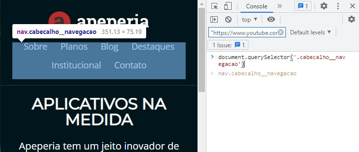

# Buscar um elemento

Para visualizar um elemento html (por exemplo, uma classe), você pode utilizar o método javascript `document.querySelector()` dentro do console do Browser. 

>The Document method `querySelector()` returns the first Element within the document that matches the specified selector, or group of selectors. If no matches are found, null is returned.

## Selectors
The selector methods accept [selectors](https://developer.mozilla.org/en-US/docs/Web/CSS/CSS_Selectors) to determine what element or elements should be returned. This includes [selector lists](https://developer.mozilla.org/en-US/docs/Web/CSS/Selector_list) so you can group multiple selectors in a single query.


## Exemplo 1:



No exemplo da imagem, o browser está apontando onde está a classe `cabecalho__navegacao`.

## Exemplo 2:

Como fazer para selecionar o elemento HTML input do tipo `tel` mostrado abaixo?

```
<input type="tel" placeholder="Digite seu telefone">
```

Resposta: 
```
document.querySelector('input[type=tel]');
```

## Selecionar todos elementos

Observe que  `querySelector()` mostra apenas o primeiro elemento do documento que corresponde ao seletor especificado. Se quiser que todos os elementos sejam mostrados, utilize [Document.querySelectorAll()](https://developer.mozilla.org/en-US/docs/Web/API/Document/querySelectorAll)


