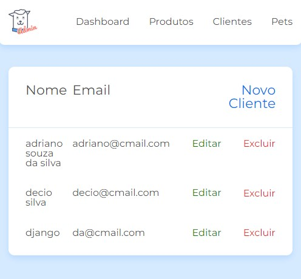

# JS na web: CRUD com JavaScript assíncrono

* Neste curso foi criado um front-end que consome dados de uma api e os exibe ao usuário.

* No front-end é possível realizar todas as operações do CRUD (create, read, update e delete) para manipular os dados de um back-end.

* Foi utilizado [json-server](https://www.npmjs.com/package/json-server) para simular um back-end.

* Foi utilizado sistema de módulos no padrão [ES Modules](./notas-de-aula/Introduction%20to%20ES%20Modules.md)

## Tecnologias utilizadas
* html
* css
* javascript
* json server (JSON Server é uma biblioteca capaz de criar uma API Fake em 30 segundos e sem precisar escrever nenhuma linha de código.)

