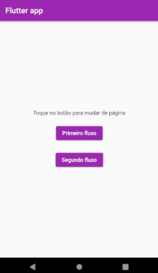

# Nuvigator v1 - Nuvigator anônimo (Implementação do nuvigator até aula 2.03)

Aprendemos a migrar do navegador de rotas nomeadas do Flutter para o nuvigator de rotas nomeadas que é anônimo, ou seja, declarado diretamente no main.dart sem ser diretamente uma nova instância de classe.

Para maiores informações, vide [README](./nuvigator.v1/README.md).

# Nuvigator v2 - Nuvigator personalizado

Entendemos como podemos criar um arquivo router que gerencia de maneira personalizada, ou seja, não é um navegador anônimo e, sim, algo que criamos e nomeamos. Com ele ganhamos alguns super poderes, entre eles o da organização em classes as rotas do app e personalizar cada rota de acordo com a necessidade de customização que cada uma tem.

Vimos como alterar as chamadas das rotas que ficam nas telas até que chegamos em uma que tira completamente a responsabilidade de as telas conhecerem as rotas e passamos essa responsabilidade para os arquivos route, que representam cada um separadamente uma rota distinta do aplicativo.

Para maiores informações, vide [README](./nuvigator.v2/README.md).

# Rotas App
Este projeto cria uma rede de páginas interligadas que utilizaremos para implementar um fluxo aninhado de rotas e navegação

Para maiores informações, vide [README](./nested_navigation/README.md)

# Tópicos importantes
* [Deep Links](./notas-de-aula/aula%2003.1%20-%20Deep%20Links.md)

